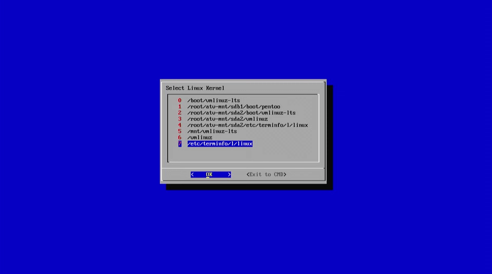
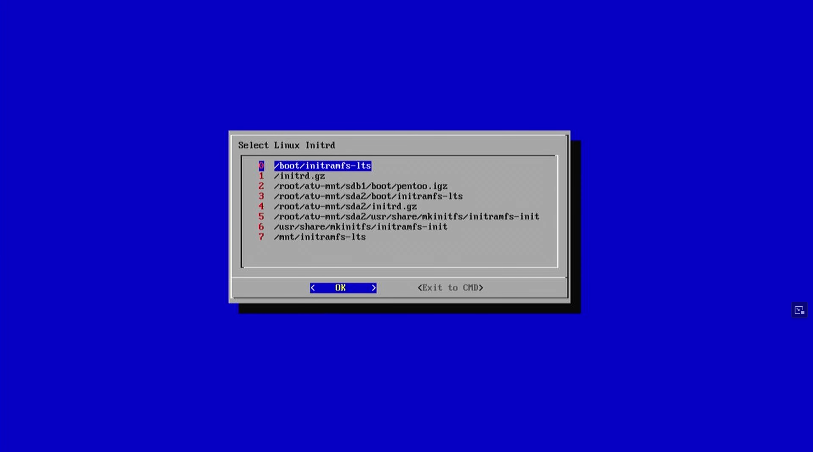
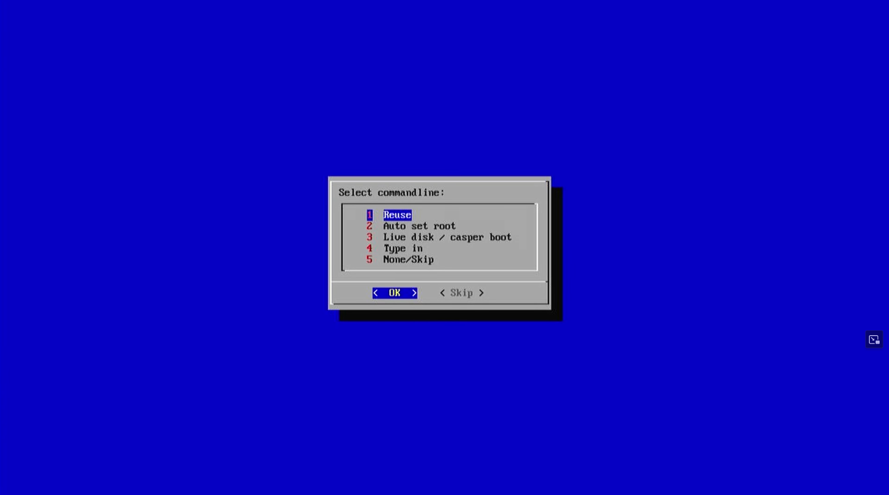

Modern version of atv-bootloader based on Alpine Linux 3.17.3 (using Linux kernel 5.15.145).  
Contains a GUI for booting (almost) any Linux distribution from any supported storage device connected to the Apple TV.

# atv-bootloader
This bootloader works by embedding a Linux kernel/initrd into "mach kernel" that boot.efi loads. Right now it will boot into a UI to select a linux kernel. You can also get to a cli  **user = root, password is empty**.
Installed on this Linux is amoung other tools `kexec` to bootload another kernel. Typical usage there is:

```
kexec --load vmlinuz --initrd=initrd.gz --command-line="root=/dev/sdb2 video=vesafb"
kexec -e
```

## How To Use
After following the installation instructions below and booting your Apple TV for the first time, you will be greeted by this image.
As mentioned above, kexec needs a kernel, initrd and command line parameters. This menu allows you to select them. If you want to go back to the alpine commandline, you can exit the boot loader here with **Exit to CMD**.


The boot loader lists all the Linux kernels it found (and files matching the same criteria) for you to choose from.  


Here you have to select your initrd just like you did for the kernel in the previous step.

Now you just have to specify a kernel command line.

You have the following options:  
* Reset the commandline alpine is booted from (more on this in the next chapter)
* Set the commandline parameter to the root of a Linux file system. This will be the same partition you selected the kernel from.
* Try using the casper boot parameters used in old versions of Ubuntu and Debian.
* Type the command line manually
* Skip / leave blank

Now your Linux should boot :)

## How To Install / Build

### Use one of my prebuild images from the `releases` tab.  
On Windows use e.g. etcher to image the file over to a USB stick.  
Linux users can use e.g. dd, macOS users can use apple pie baker (or dd).


### Build your own boot stick.

To create a boot stick, you need any type of storage that Apple TV supports. It can be a hard drive, an SSD, an SD card, a USB stick, or anything else you can connect to the ATV.  
Format it using a GPT partition table.  
Now you need to create two partitions, one for the Apple TV to boot from (sometimes called recovery) and one for the root partition of the Linux you want to use.  

Create a boot partition of type HFS+. The label doesn't matter, but you need to make sure it fits your mach kernel (Linux kernel + initrd). I always use 256 MiB, which is plenty of space.  
Once the partition is created, you need to set the filesystem flag "atvrecv" to on. This will tell Apple TV which partition to boot the mach kernel from.
The second partition is up to you. I used an ext4 formatted partition for my bootloader.
Now you need to build your mach kernel. This process can be very different depending on the distribution you want to build for the Apple TV and the OS you are using.
The following explains it based on my boot loader based on Alpine Linux and Debian 12 to build everything.
All necessary files are available in the repo.  

First, copy the darwin-cross compiler from darwin-cross to /opt/. You can just copy the whole folder `sudo cp -r darwin-cross /opt/darwin-cross`.
Make sure you have glibc for x86  (package name `libc6:i386`) and of course the `build-essential` package installed.
If you want to base your boot stick off of some other Linux you now have to replace the provided vmlinuz and initrd.gz with the equivalent from your distro.
Run make and you should have a new mach_kernel in the **boot** directory of your cloned repo.

Copy `boot.efi, mach_kernel` and the rest of the files from the **/boot**-directory to your boot partition.
You can now test if the stick boots. It should at least show you the bootlogo (provided as BootLogo.png)
If this works congrats, you can now boot anything (Linux based) you want on your Apple TV.  


Lets now prepare the root partition.
You will need to provide a root file system for your Linux here. For me, I installed Alpine in a VM and configured everything I wanted there.
This can then be imaged to the root partition. If you want Alpine, I have provided my root partition in the releases tab.  
Now we're almost done. You will probably need to give your kernel some command line parameters to allow it to find your root partition.
This is also done in the boot partition. The file **com.apple.Boot.plist** contains a key-value pair called `Kernel FlagsL. For inspiration on what to put here, take a look at my file in this repo, or a grub file for your distribution.
Now you should be ready to boot your own linux bootloader on your Apple TV, congratulations :).

For reference the old instructions can be found here: *[LinuxUSBPenBoot](https://github.com/lemonjesus/atv-bootloader/wiki/LinuxUSBPenBoot)*

## Common Issues
* Some users need to hold **menu** and **-** buttons down on the IR remote  

* Some distros just won't boot with this boot loader. I may be able to get some to work eventually, but don't hold your breath.

## Uses
* Main used case. Use as kexec based bootloader. If you want to quickly boot a linux distro from any storage device you can connect to the apple tv use this.


* Create your own Boot Stick
See **How To Use** paragraph 2


* Use as Linux distro for your apple tv. For now it is only command line based. In the future I want to provide more images with desktop distros.


## Special Thanks
* Special thanks to `lemonjesus` for continuing work on the bootloader.
* Special thanks to the `OSMC` team for their support of the apple tv hardware.
* Special thanks to the original devleoper: `davilla`
* Special thanks to `Edgar (gimli) Hucek` for the 1st boot and original code (mach_linux_boot) and James McKenzie of Mythic-Beasts for mb_boot_tv.
